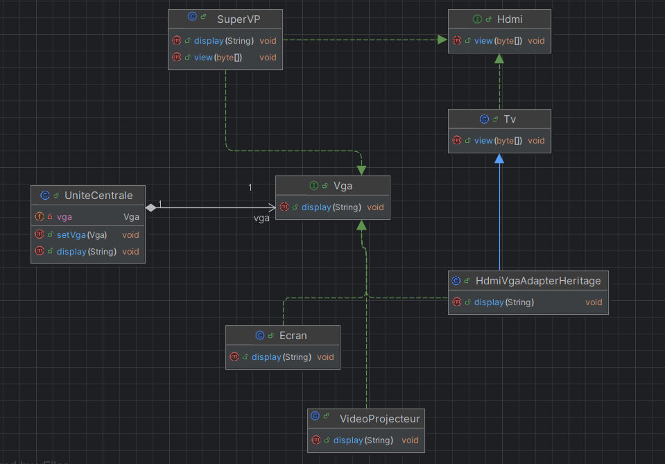
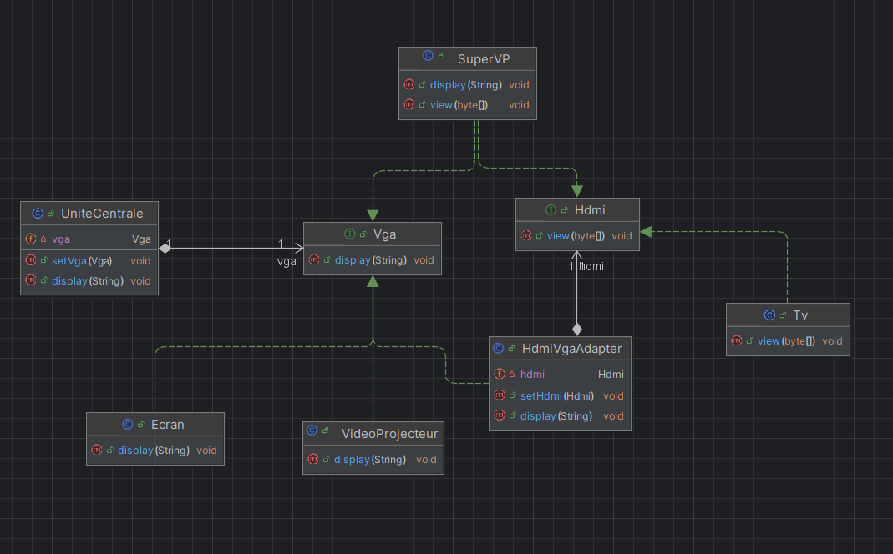

# Design Pattern Adapter

## Contexte
Le pattern Adapter permet de faire en sorte que deux classes incompatibles puissent collaborer.
Ce design pattern agit comme un pont entre les classes qui ont des interfaces différentes, 
en convertissant l'interface d'une classe en une autre attendue par les clients.

Dans ce cas, nous avons un exemple où des appareils (comme une télévision ou un vidéoprojecteur)
utilisant HDMI doivent être connectés à une unité centrale qui utilise VGA.

## Diagrammes de Classe
### Diagramme basé sur l'Héritage

### Diagramme basé sur la Composition

## Conclusion
Le design pattern Adapter est utile pour assurer la compatibilité entre deux systèmes incompatibles.
Dans cet exemple, nous avons vu comment il peut être implémenté à l'aide de la composition ou de l'héritage,
selon les besoins du projet.
